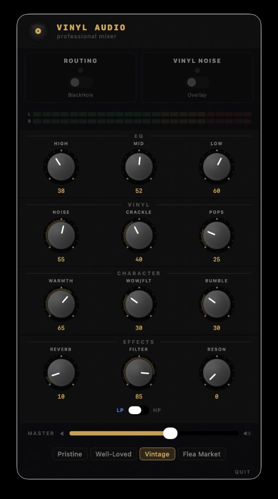

# Mac Rotary Vynil Mixer

A macOS menu bar app that applies real-time vinyl record simulation effects to your audio. Built with SwiftUI and Core Audio.


<p align="center">
  
</p>

## What it does

Mac Rotary Vynil Mixer sits in your menu bar and adds the warm, nostalgic character of vinyl records to any audio playing on your Mac. It works in two independent modes:

- **Vinyl Noise** — generates ambient vinyl noise (surface hiss, crackle, pops, rumble) overlaid on top of your audio
- **Routing** — captures system audio through a virtual loopback device, applies vinyl processing (warmth, wow & flutter, EQ, filter, reverb), and outputs the result to your speakers

Both modes can run simultaneously for the full vinyl experience.

## Features

- Professional rotary mixer UI with chrome knobs, dot scales, and blue LED indicators
- 3-band EQ (HIGH / MID / LOW) with cut and boost
- Resonant state variable filter with LP/HP mode toggle
- Multi-tap delay reverb
- 6 vinyl character controls: Surface Noise, Crackle, Pops, Warmth, Wow & Flutter, Rumble
- Real-time VU meters (L/R) with green/yellow/red segments
- 4 presets: Pristine, Well-Loved, Vintage, Flea Market
- Master volume control
- Independent routing and noise toggles
- Crash recovery — restores original audio devices on relaunch
- Zero dependencies — pure Swift, no third-party packages

## Quick Install

### Download

Grab the latest `VinylAudio-x.x.x-macOS.zip` from the [Releases](../../releases) page.

1. Unzip `VinylAudio.app`
2. Drag it to `/Applications`
3. Open it — click the vinyl disc icon in your menu bar

> **Note:** On first launch, macOS may say the app is from an unidentified developer. Go to **System Settings → Privacy & Security** and click **Open Anyway**.

### Build from source

```bash
git clone git@github.com:gsampaio-rh/mac-rotary-vynil-mixer.git
cd mac-rotary-vynil-mixer
make install
```

This builds a release binary and copies `VinylAudio.app` to `/Applications`.

### Other build commands

```bash
make build      # Release build only
make package    # Build + create .app bundle in current directory
make release    # Build + create distributable .zip
make clean      # Remove build artifacts
```

## BlackHole setup (for Routing mode)

Routing mode requires [BlackHole](https://existential.audio/blackhole/), a free virtual audio driver.

1. Install [BlackHole 2ch](https://existential.audio/blackhole/)
2. Launch Mac Rotary Vynil Mixer
3. Toggle **ROUTING** — the app handles device switching automatically

When routing is active, the app temporarily sets your system output to BlackHole, captures the audio, processes it through the vinyl DSP chain, and outputs to your original speakers/headphones. When you toggle routing off (or quit the app), your original audio devices are restored.

Vinyl Noise mode works without BlackHole.

## Usage

Click the vinyl disc icon in your menu bar to open the mixer panel.

| Section | Controls |
|---|---|
| **Toggles** | ROUTING (system audio passthrough) and VINYL NOISE (overlay) — independent, both can be active |
| **EQ** | HIGH, MID, LOW — center position is flat, left cuts, right boosts |
| **Vinyl** | NOISE (surface hiss), CRACKLE (dust), POPS (clicks) |
| **Character** | WARMTH (saturation), WOW/FLT (pitch wobble), RUMBLE (low-freq vibration) |
| **Effects** | REVERB (room ambience), FILTER (LP/HP sweep), RESON (filter resonance) |
| **Master** | Overall output level slider |
| **Presets** | Pristine, Well-Loved, Vintage, Flea Market |

Drag **up/down** on any knob to adjust its value.

## DSP Algorithms

| Effect | Algorithm |
|---|---|
| Surface Noise | Voss-McCartney pink noise (12 octave bands) |
| Crackle | Probabilistic trigger with exponential decay envelope |
| Pops | High-impulse events with randomized polarity |
| Warmth | Soft saturation (`tanh` waveshaper) + one-pole low-pass filter |
| Wow & Flutter | Variable delay line modulated by dual LFOs (0.8 Hz wow + 7 Hz flutter) |
| Rumble | Dual low-frequency oscillators (23 Hz + 31 Hz) |
| 3-Band EQ | Additive shelving EQ with one-pole crossover filters (300 Hz / 500–2000 Hz / 3 kHz) |
| Filter | State variable filter (LP/HP) with exponential frequency mapping (20 Hz–20 kHz) |
| Reverb | Multi-tap delay (7 taps) with LP-filtered feedback |
| Groove Modulation | 0.55 Hz periodic level variation (simulates 33 RPM rotation) |
| Stereo Field | Delay-based decorrelation with micro-noise spread |

All DSP uses a real-time safe xorshift64 RNG — no heap allocations on the audio thread.

## Architecture

```
Sources/VinylAudio/
├── VinylAudioApp.swift    # App entry point, menu bar setup
├── MenuBarView.swift      # Rotary mixer UI (knobs, VU, toggles)
├── AudioEngine.swift      # AVAudioEngine management (overlay + passthrough)
├── VinylDSP.swift         # All DSP algorithms (real-time safe)
├── VinylSettings.swift    # Observable settings + presets
├── DeviceManager.swift    # Core Audio device enumeration & routing
└── RingBuffer.swift       # Thread-safe SPSC circular buffer
```

See [docs/ARCHITECTURE.md](docs/ARCHITECTURE.md) for the detailed system design.

## How it works

### Overlay mode (Vinyl Noise)

A single `AVAudioEngine` with an `AVAudioSourceNode` generates vinyl noise directly and outputs to the default audio device. No system audio capture required.

### Passthrough mode (Routing)

Two separate `AVAudioEngine` instances:

1. **Capture engine** — sets system output to BlackHole, installs a tap on its `inputNode` to read audio, writes samples to a thread-safe ring buffer
2. **Playback engine** — reads from the ring buffer via `AVAudioSourceNode`, processes through the full DSP chain (EQ → Filter → Wow & Flutter → Warmth → Noise → Reverb), outputs to the original speakers/headphones

This two-engine architecture ensures independent device routing without feedback loops.

## Requirements

- macOS 14 (Sonoma) or later
- Apple Silicon or Intel Mac
- [BlackHole 2ch](https://existential.audio/blackhole/) (optional — only needed for Routing mode)

## License

[MIT](LICENSE)
